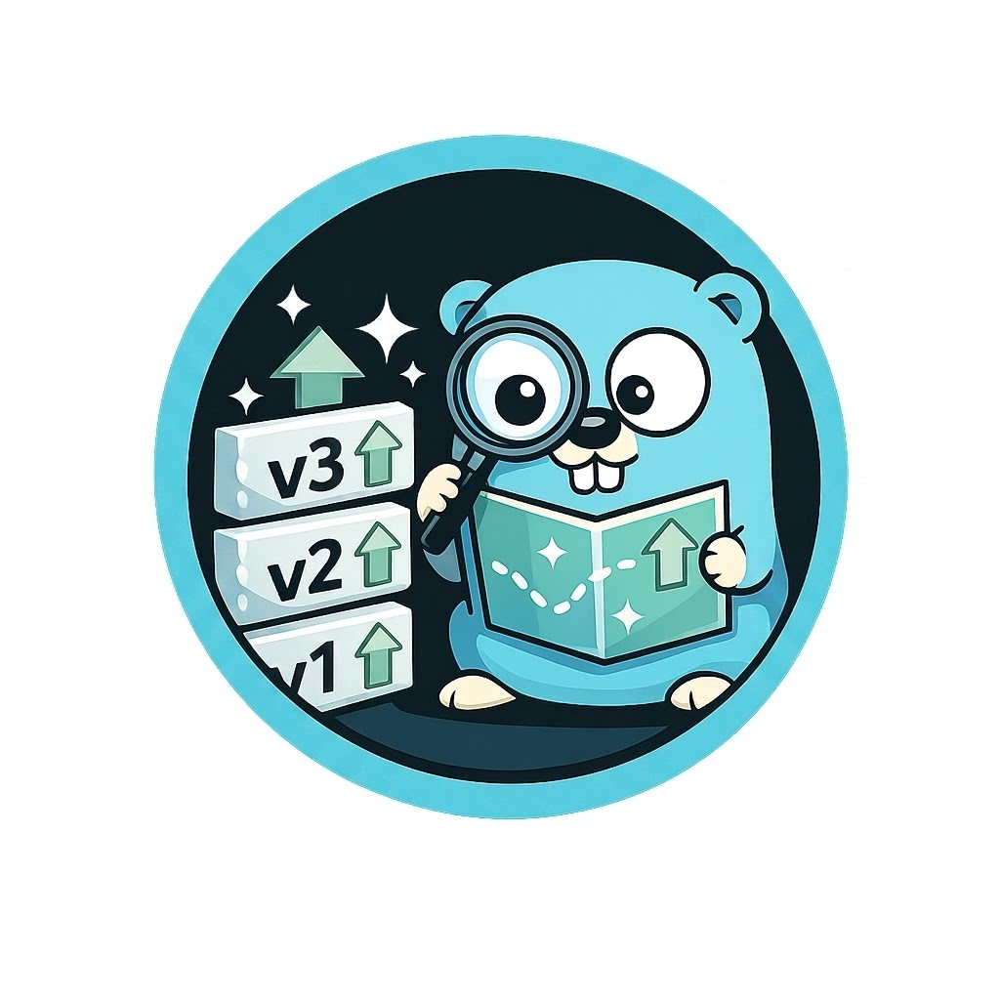

# GoMajor

<p align="center">
  
</p>

<p align="center">
  <a href="https://goreportcard.com/report/github.com/chimanjain/gomajor"></a>
  <a href="https://pkg.go.dev/github.com/chimanjain/gomajor"></a>
</p>

A fast, color-coded CLI tool designed to help you keep your Go dependencies up-to-date. GoMajor parses your `go.mod` files and queries the Go Module Proxy to proactively discover both **minor updates** (🟢 Green) and **major upgrades** (🟡 Yellow).

### 💡 Why GoMajor?

Standard commands like `go list -m -u all` are great for finding minor updates, but they completely miss new major versions. Because Go treats different major versions (e.g., `github.com/foo/bar` vs `github.com/foo/bar/v2`) as entirely separate modules, standard tools won't notify you when a library releases a new major version.

**GoMajor bridges this gap**, ensuring you never miss a critical major release again.

### ✨ Key Features

- 🚀 **Discover Major Upgrades:** Finds new major versions (v2, v3+) that standard Go tools miss.
- 🌐 **Remote Scanning:** Check dependencies directly from remote GitHub repositories without cloning.
- 🎨 **Clear Visuals:** Color-coded terminal output (supporting `--no-color` mode and precise Unicode width formatting).
- ⚙️ **Multi-Source Config:** Check multiple local projects and remote repositories at once using a `yaml` config.
- 📊 **CI/CD Ready:** Export dependency reports to structured JSON or YAML formats.
- 🔒 **Security & Privacy:** Bypasses public proxies for private modules (`GOPRIVATE`) and redacts credentials/tokens in outputs.

---

## Quick Start

### Installation

```bash
# Install instantly
go install github.com/chimanjain/gomajor@latest

# Or build from source
git clone https://github.com/chimanjain/gomajor.git && cd gomajor && go build -o gomajor
```

### Basic CLI Usage

```bash
# Check direct dependencies in the current directory
gomajor

# Check all (including indirect) dependencies for a specific file
gomajor -f /path/to/go.mod --all

# Disable minor or major checks explicitly
gomajor --minor=false
gomajor --major=false

# Check remote GitHub repositories directly
gomajor -g owner/repo,github.com/owner/repo2

# Check dependencies and save results directly to a structured report
gomajor -o report.json
```

---

## Configuration & Flags

### CLI Flags

| Flag | Shorthand | Description | Default | Example |
| --- | --- | --- | --- | --- |
| `--file` | `-f` | Path to target `go.mod` file | `""` (auto-detect) | `gomajor -f ./sub/go.mod` |
| `--all` | `-a` | Check indirect dependencies too | `false` | `gomajor -a` |
| `--max-probe` | `-m` | Max subsequent major versions to probe | `5` | `gomajor -m 10` |
| `--minor` | | Toggle minor version updates checking | `true` | `gomajor --minor=false` |
| `--major` | | Toggle major version upgrades checking | `true` | `gomajor --major=false` |
| `--config` | `-c` | Path to multi-source YAML config file | `"gomajor.yaml"` | `gomajor -c my-config.yaml` |
| `--github` | `-g` | Direct comma-separated GitHub repositories | `""` | `gomajor -g owner/repo` |
| `--output` | `-o` | Save results to a structured YAML or JSON report file | `""` | `gomajor -o report.json` |
| `--json` | | Format reports and stdout data in JSON | `false` | `gomajor --json` |
| `--no-color` | | Suppress ANSI colored terminal formatting | `false` | `gomajor --no-color` |

### Multi-Source Checking (`gomajor.yaml`)

Define multiple local directories and remote GitHub repositories to analyze in a single run:

```yaml
local:
  - "/path/to/project1/go.mod"
github:
  - "owner/repo"
  - "https://github.com/owner/repo2/blob/develop/go.mod"
output: "gomajor-report.json" # Supports both .yaml and .json formats
minor: true
major: true
```

### GitHub Actions Integration

You can integrate GoMajor into your CI/CD pipelines to automatically audit direct and indirect dependencies for both minor updates and major upgrades.

Add the following workflow file to `.github/workflows/gomajor-dependency-audit.yml`:

```yaml
name: GoMajor Dependency Audit
permissions:
  contents: read
on:
  pull_request:
    branches: [main]

jobs:
  gomajor-dependency-audit:
    runs-on: ubuntu-latest
    steps:
      - name: Checkout Code
        uses: actions/checkout@v6

      - name: Set up Go
        uses: actions/setup-go@v6
        with:
          go-version: "1.26"

      - name: Install GoMajor
        run: go install github.com/chimanjain/gomajor@latest

      - name: Run Dependency Audit
        run: gomajor
```

### Environment Variables & Security

GoMajor respects standard Go environment variables to ensure compatibility, privacy, and speed:

- `GOPROXY`: Specifies the Go module proxy URL (defaults to `https://proxy.golang.org`).
- `GOPRIVATE` / `GONOPROXY`: Comma-separated list of glob patterns for private module paths. GoMajor automatically bypasses public proxy queries for matching private dependencies, preventing internal package names from leaking to public proxies and avoiding query timeouts.

Additionally, GoMajor includes robust security defenses:

- **Credential Sanitization:** Automatically sanitizes user credentials and tokens from remote source URLs in CLI output and exported JSON/YAML reports (replacing them with `redacted`).
- **Remote Size Protection:** Limits remote `go.mod` downloads to a maximum of 10MB to protect against potential memory exhaustion attacks (e.g., zip bombs).

---

## Output Examples

### Terminal Format (Default)

```text
https://raw.githubusercontent.com/spf13/cobra/main/go.mod (github)
  MODULE               CURRENT   MINOR     MAJOR         NEW PATH
  go.yaml.in/yaml/v3   v3.0.4    -         v4.0.0-rc.4   go.yaml.in/yaml/v4
```

### YAML Report Format

```yaml
results:
  - source: https://raw.githubusercontent.com/spf13/cobra/main/go.mod
    source_type: github
    dependencies:
      - module: go.yaml.in/yaml/v3
        current_version: v3.0.4
        latest_major_version: v4.0.0-rc.4
        latest_major_path: go.yaml.in/yaml/v4
        has_update: true
```

### JSON Report Format

```json
{
  "results": [
    {
      "source": "https://raw.githubusercontent.com/spf13/cobra/main/go.mod",
      "source_type": "github",
      "dependencies": [
        {
          "module": "go.yaml.in/yaml/v3",
          "current_version": "v3.0.4",
          "latest_major_version": "v4.0.0-rc.4",
          "latest_major_path": "go.yaml.in/yaml/v4",
          "has_update": true
        }
      ]
    }
  ]
}
```

---

## Development & Architecture

### Testing

```bash
go test -cover ./...
```

### Architecture

- **`checker`**: Core engine for querying the Go Module Proxy.
- **`utils`**: Centralized, zero-dependency package for Go module path parsing, version path formatting, and proxy path escaping.
- **`cmd`**: Decoupled CLI architecture built with Cobra:
  - `runner.go`: Core execution flow routing and concurrent proxy checking.
  - `formatter.go` / `types.go`: Output visualization and reporting structures.
  - `github.go` / `root.go`: Remote path parsing and Cobra commands bootstrapping.
